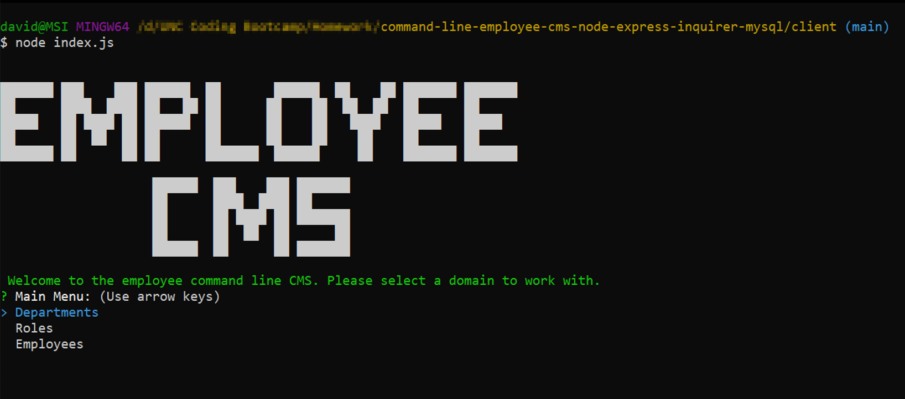

# Command Line Employee Content Management System using Node, Express, Inquirer, Console.Table, MySQL Database

███████ ███    ███ ██████  ██       ██████  ██    ██ ███████ ███████
██      ████  ████ ██   ██ ██      ██    ██  ██  ██  ██      ██
█████   ██ ████ ██ ██████  ██      ██    ██   ████   █████   █████
██      ██  ██  ██ ██      ██      ██    ██    ██    ██      ██
███████ ██      ██ ██      ███████  ██████     ██    ███████ ███████

                    ██████  ███    ███ ███████
                    ██      ████  ████ ██
                    ██      ██ ████ ██ ███████
                    ██      ██  ██  ██      ██
                    ██████  ██      ██ ███████

A content management system for an employees database schema. 

This application is really two applications (client and server) with full CRUD capability for each of the tables of the associated database. There is a [node.js](https://nodejs.org/en/) and [express.js](https://expressjs.com/) server located in the `./server/` folder which connects to a [mySQL](https://www.mysql.com/) database using [MySQL2](https://www.npmjs.com/package/mysql2). Located in `./server/db` are the schema and seed data files needed to create the database for the node server to interact with. The node server uses modular routing where when `./server.js/` is started it runs `./server/routes/index.js` which in turn allows `./server/routes/department.js`, `./server/routes/role.js` and `./routes/server/employee.js` files to run and control their respective requests. These files all rely on `./server/helper/dbConnection.js` to connect and interact with the mySQL database. Each API route has CRUD functionality for the associated table. The connection information can also be updated here. The project also has [nodemon](https://www.npmjs.com/package/nodemon) available for debugging on the server project. Run with `nodemon ./server.js`.

There is also a command line client which connects to this server side API. It utilizes [inquirer.js](https://www.npmjs.com/package/inquirer) for command line user interaction and [console.table](https://www.npmjs.com/package/console.table) to display table data to users. The client app can be used by running `./client/index.js`. It currently has two helper files. `./client/helpers/apiConnection.js` uses the [node-fetch](https://www.npmjs.com/package/node-fetch) package to make API calls to our server app. Each of the calls are broken into separate functions for future extensibility. The file `./helpers/inquirerOptions.js` contains objects which are passed to inquirer for questions. The app itself is able to display tables of data relevant to the user in between sets of questions and then accumulate the answers and pass them to the API calls. 

## Database Schema

## Installation

As mentioned above there are two applications. MySQL needs to be installed locally or on a cloud server. Then first run the `./server/db/schema.sql` followed by the `./server/db/seed.sql` to have a preliminary version of the database ready with seed data. Then run `node install` within the server file to pull node modules. The server itself can be run  with `node ./server.js` or `nodemon ./server.js` for development. Once the server is up and running it is an independent RESTful API. Thus the browser or REST client (ex: Postman) can be used to call it. More details below. 

Next is the client, which also makes calls to the REST API server. It can be run locally also or run separately and be configured to connect to the server. The top of the `./client/helpers/apiConnection.js` file is where connection information can be updated. This is also a node project and `node install` needs to be run here separately. Once complete `node ./index.js` can be run to start the client app. It will automatically connect to the server assuming credentials are valid. 

## API

As mentioned above the API server is a separate application. This server is available via REST with or without the client. These could be called locally once the server is running on your machine via the install instructions above. 

The code is also deployed/running on [Heroku](https://www.heroku.com/) at the following address. Below are some example commands available. <<<<<<>>>>>>

Available Calls:
* POST - http://localhost:3001/api/department/ - create a new department
    * Body example: `{
                        "name": "My Department Name"
                     }`
* GET - http://localhost:3001/api/department/ - get all departments
* GET - http://localhost:3001/api/department/{id} - get specific department
* PUT - http://localhost:3001/api/department/ - update specific department
    * Body example: `{
                        "id": 1,
                        "name": "My Department Name"
                     }`
* DELETE - http://localhost:3001/api/department/{id} - delete specific department
* POST - http://localhost:3001/api/role/ - create a new role
    * Body example: `{
                        "title": "Title Example",
                        "salary": "1000000.03",
                        "department_id": 2
                     }`
* GET - http://localhost:3001/api/role/ - get all roles (This includes a JOIN to pull foreign key names/titles)
* GET - http://localhost:3001/api/role/{id} - get specific role
* PUT - http://localhost:3001/api/role/ - update specific role
    * Body example: `{
                        "id": 1,
                        "title": "My Test",
                        "salary": "1000000.02",
                        "department_id": 7
                     }`
* DELETE - http://localhost:3001/api/role/{id} - delete specific role
* POST - http://localhost:3001/api/employee/ - create a new employee
    * Body example: `{
                        "first_name": "Alice",
                        "last_name": "Jones",
                        "role_id": 3,
                        "manager_id": 1
                     }`
* GET - http://localhost:3001/api/employee/ - get all employee (This includes a JOIN to pull foreign key names/titles)
* GET - http://localhost:3001/api/employee/{id} - get specific employee
* PUT - http://localhost:3001/api/employee/ - update specific employee
    * Body example: `{
                        "id": 1,
                        "first_name": "Alice",
                        "last_name": "Jones",
                        "role_id": 3,
                        "manager_id": 1
                     }`
* DELETE - http://localhost:3001/api/role/{id} - delete specific role

## Screenshots

### Main Menu

### Display Tables

### Node Server Running

================

//deploy to heroku?

//walkthrough video
//link to github repo